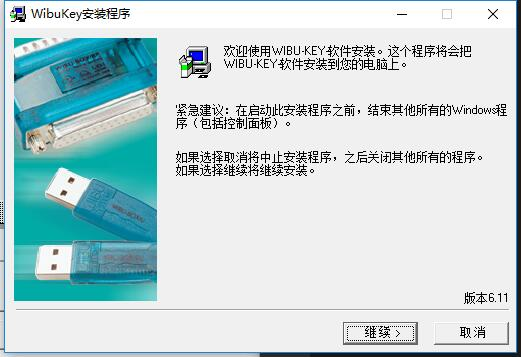
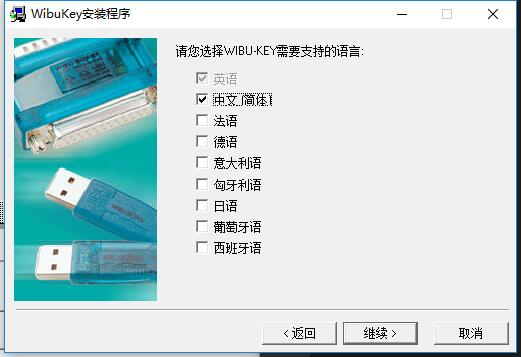
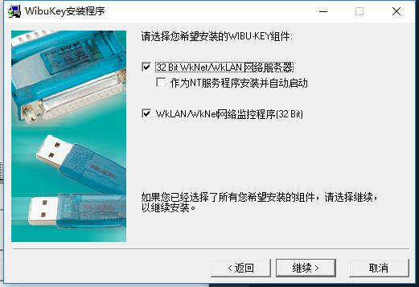
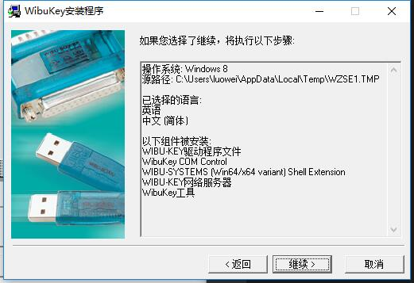
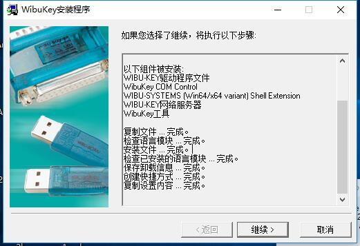
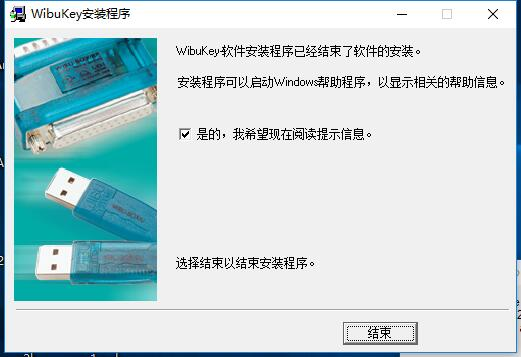
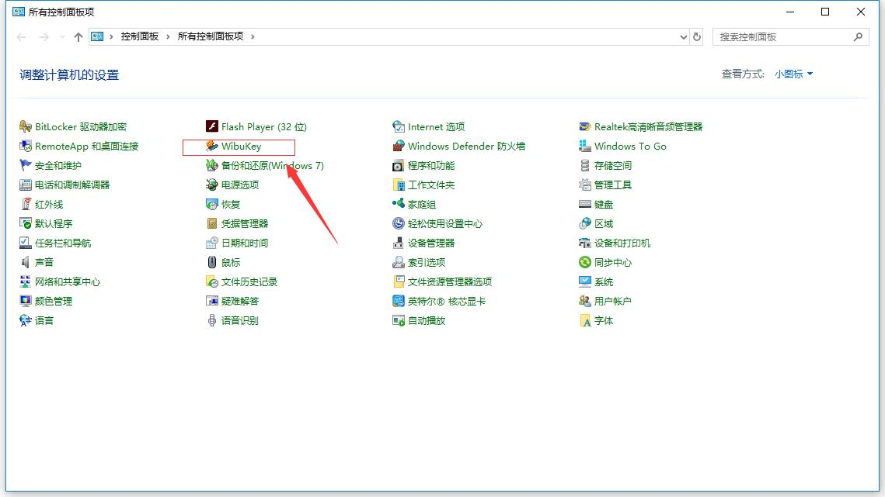
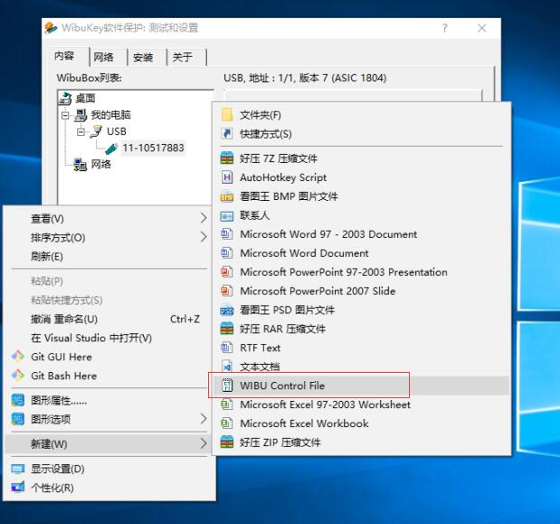
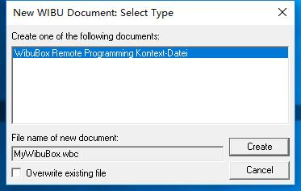

# 海鑫授权码生成指导文档
- 安装加密狗驱动程序`加密狗驱动WkRuntime.exe`

## 打开加密狗程序
- 进入控制面板,打开WibuKey

## 获取 `MyWibuBox.wbc` 文件
- 桌面右键选择 `WIBU Control File`

- 点击 `Create`

- 桌面会创建如下文件,双击打开

------------------------------------------------------
> 创建时间: 2018年4月17日11:25:29